# APP

## CHALLENGE

https://github.com/smash-gift/fullstack-dev-test

## TECHNOLOGIES
- Dart/Flutter

## REQUIREMENTS
- flutter >=2.16.2 <3.0.0

## SCREENSHOTS IOS

The ios's screenshots can be seen down below:

## LOGIN
[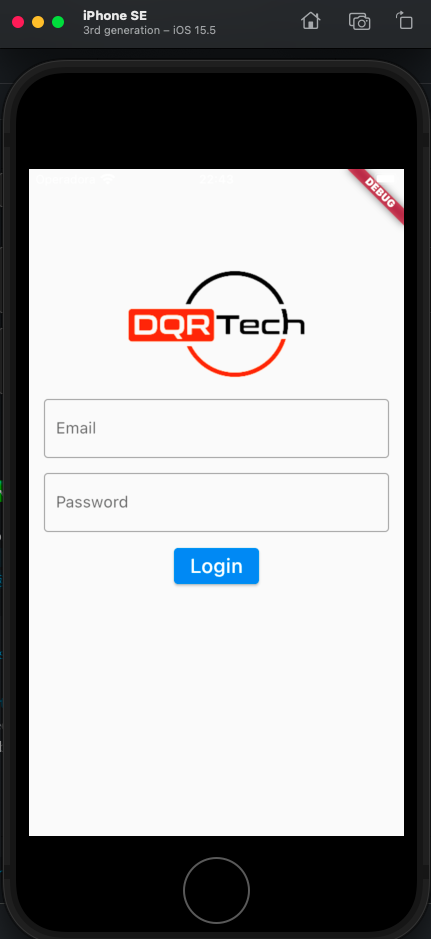](Login)

## COUNTRIES LIST
[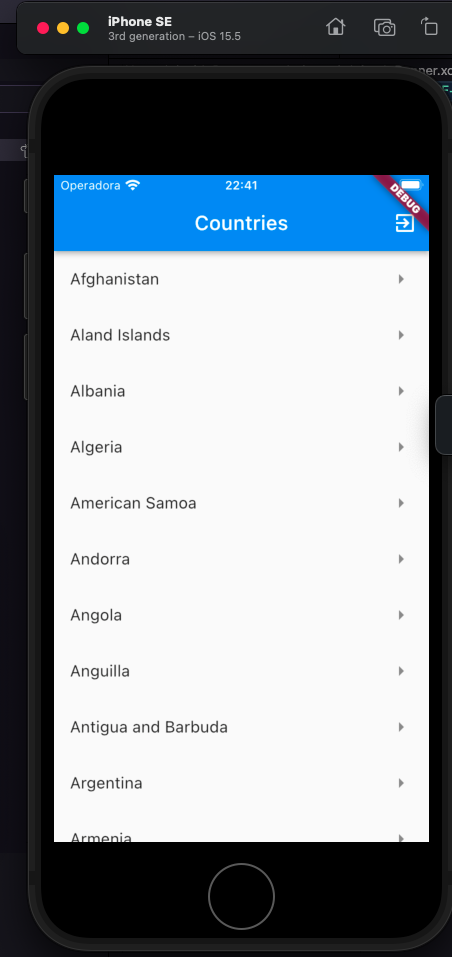](Countries)

## CITIES LIST
[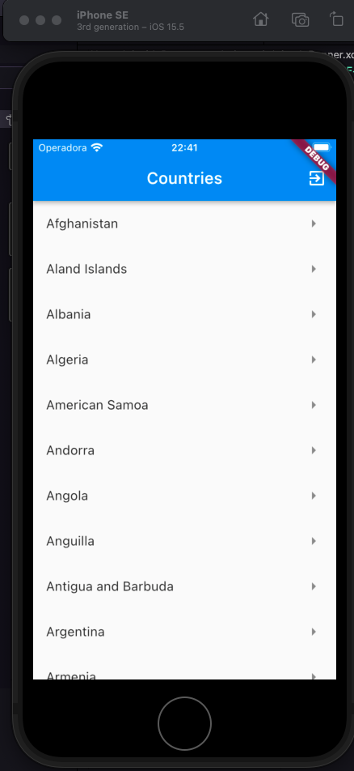](Cities)

## GOOGLE MAPS
[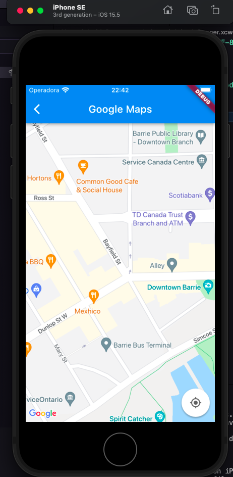](Google_Maps)

## SCREENSHOTS ANDROID

The android's screenshots can be seen down below:

## LOGIN
[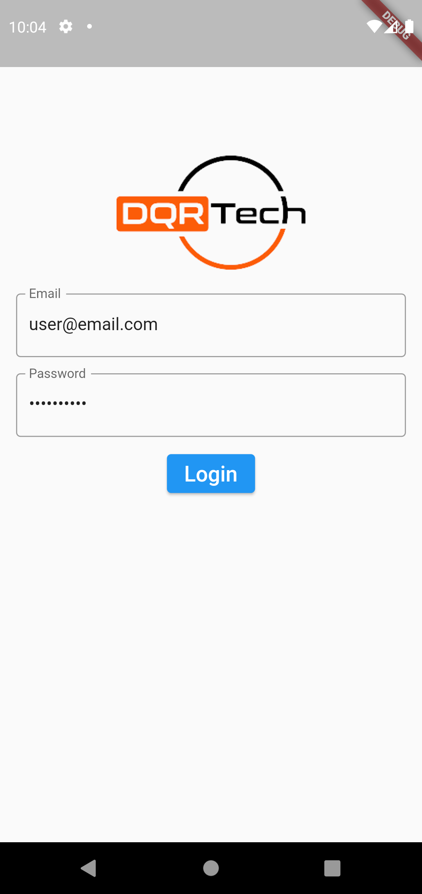](Login)

## COUNTRIES LIST
[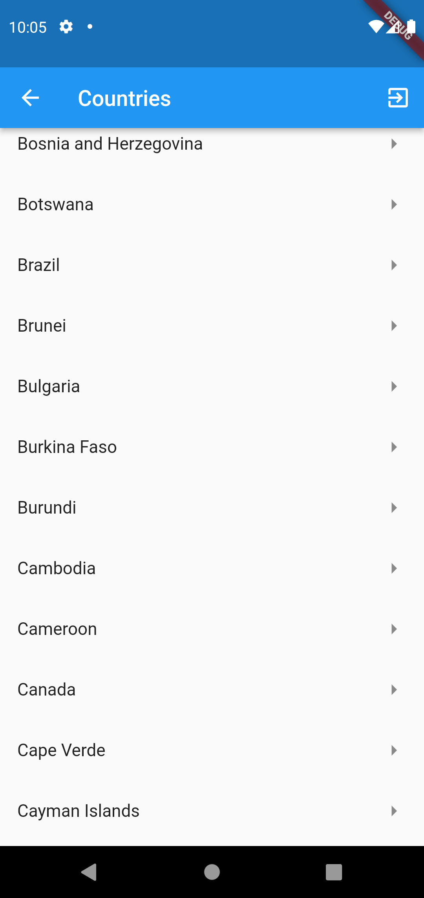](Countries)

## CITIES LIST
[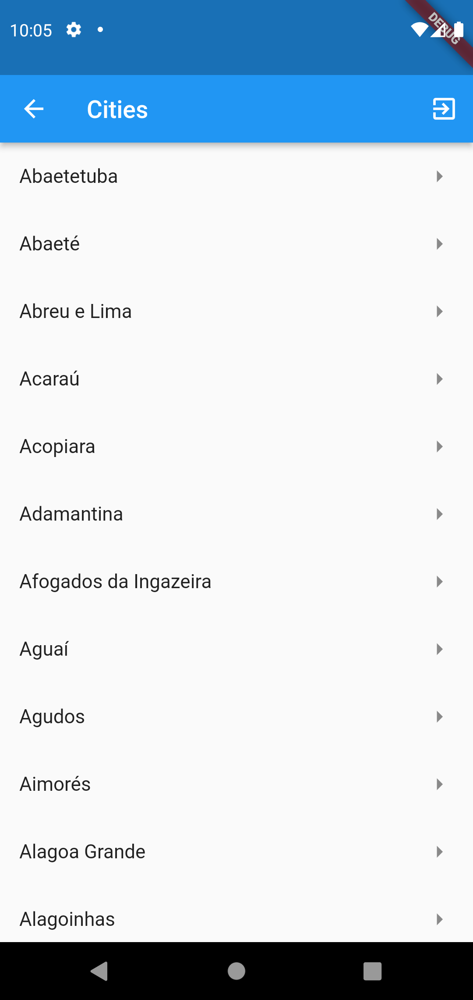](Cities)

## GOOGLE MAPS
[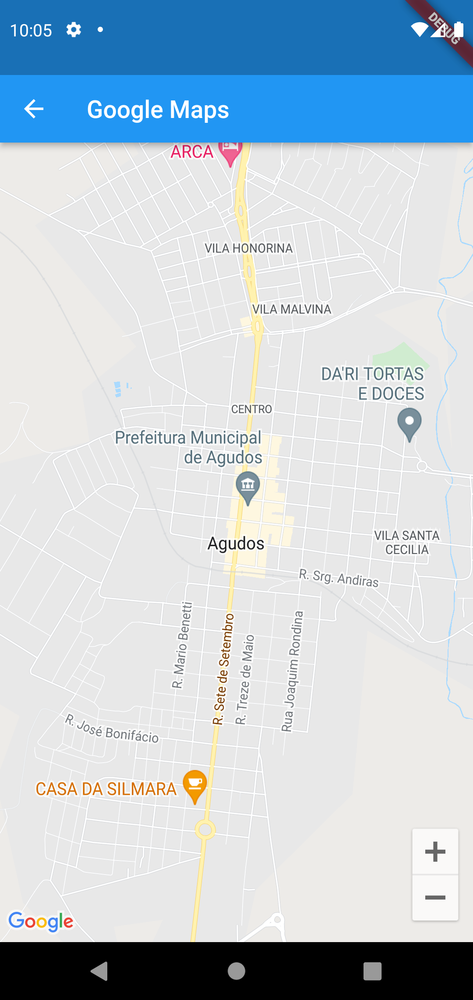](Google_Maps)

## SERVICES SCREENSHOTS

## GOOGLE ANALYTICS
[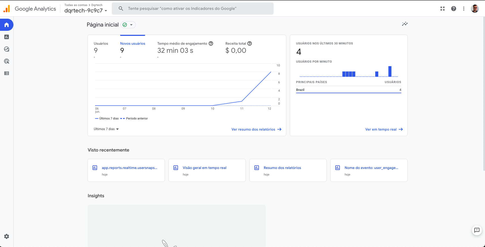](GoogleAnalytics)

## GOOGLE ANALYTICS GRAPH
[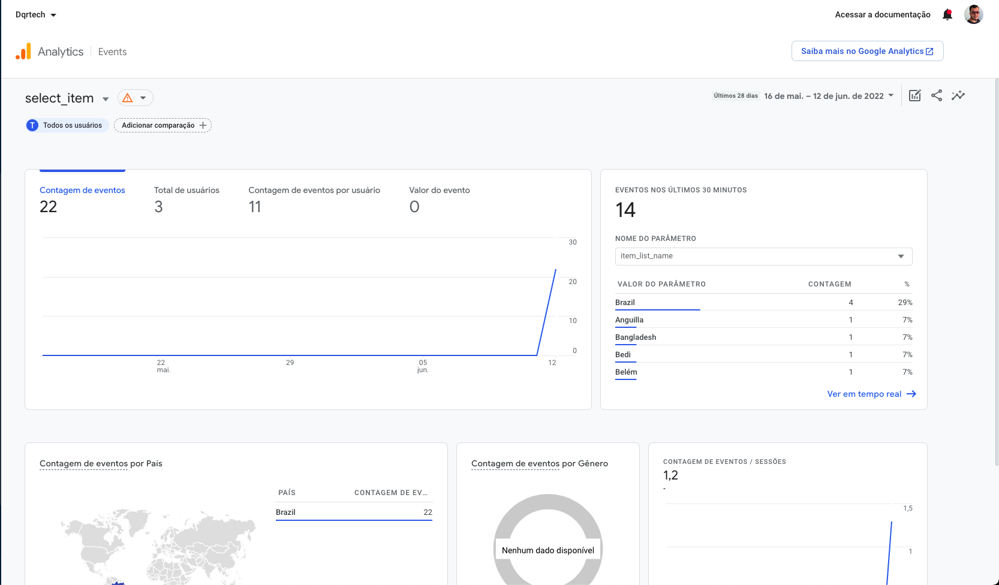](GoogleAnalyticsGraph)

## GOOGLE CRASHLITYCS
[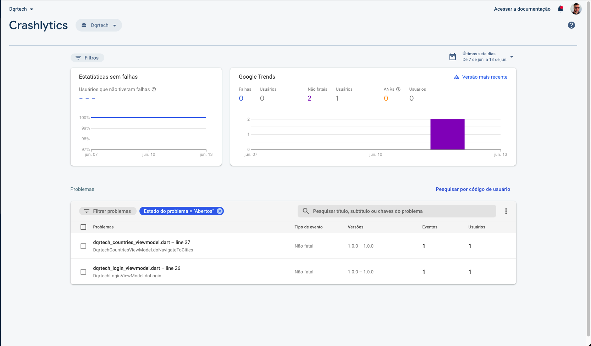](GoogleCrashlytics)

## FIRESTORE
[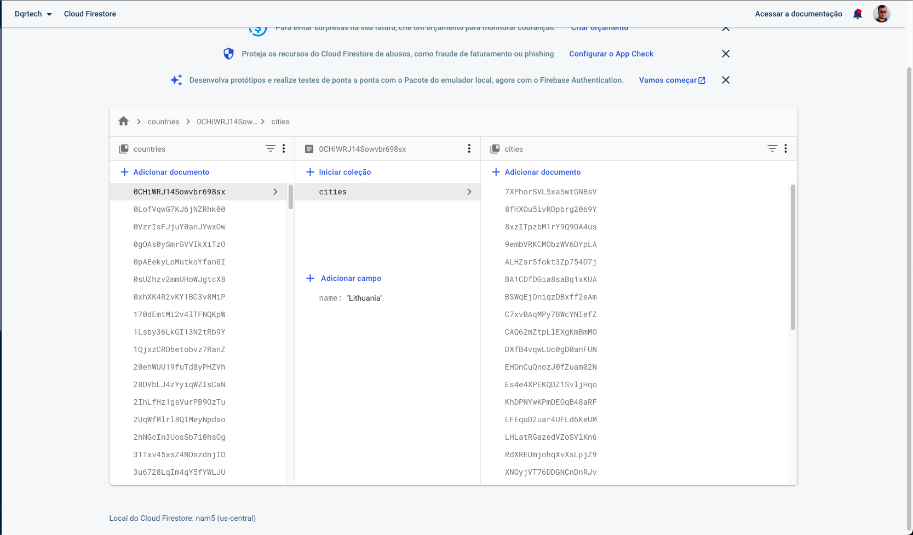](GoogleFirestore)

## GOOGLE FIREBASH AUTH
[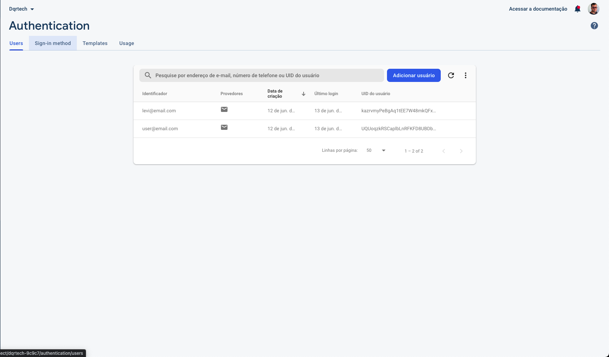](GoogleFirebaseAuth)

## GOOGLE MAPS/GEOCODING
[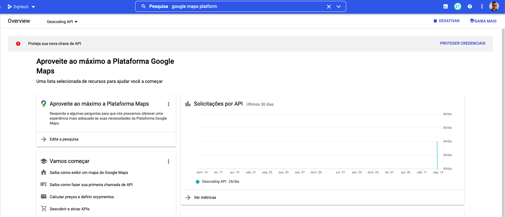](GoogleMaps)


## USAGE

You need to use the folowing credentials to access the app:

```
email: user@email.com
password: 123Change@
```

## INSTALL

Once you have the project in your computer, you just need to install the dependencies:

```
flutter pub get
```

After everything is installed, you can just start the project on your emulator:

```
flutter run
```

## TESTS

```
flutter test
```
